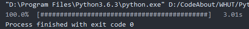

## # 1

> 日期输出

```python
inputYear = int(input("year:"))
inputMonth = int(input("month:"))
inputDay = int(input("day:"))

monthMap = [
    'January', 'February', 'March', 'April', 'May', 'June',
    'July', 'August', 'September', 'October', 'November', 'December'
]

dayPostfix = ['1st', '2nd', '3rd']

if inputMonth not in range(1, 13):
    print('Error inputMonth\t', inputMonth)
elif inputDay not in range(1, 32):
    print('Error inputDay\t', inputDay)
else:
    d0 = inputDay % 10
    d1 = inputDay // 10
    if d0 in [1, 2, 3] and d1 is not 1:
        if d1 is 0:
            outputDay = '' + dayPostfix[d0 - 1]
        else:
            outputDay = str(d1) + dayPostfix[d0 - 1]
    else:
        outputDay = '{}th'.format(inputDay)
    print('\n{} {}, {}'.format(monthMap[inputMonth - 1], outputDay, inputYear))
```


## # 2

> 输出田字格

```python
for i in range(1, 12):
    if i % 5 is 1:
        for k in range(1, 12):
            if k % 5 is 1:
                print('+', end=' ')
            else:
                print('-', end=' ')
    else:
        for k in range(1, 12):
            if k % 5 is 1:
                print('|', end=' ')
            else:
                print(' ', end=' ')
    print()
```


## # 3

> 判断回文数

```python
n = input('n: ')
if int(n) < 10:
    print(True)
else:
    test = list(n)
    test.reverse()
    if int(''.join(test)) == int(n):
        print(True)
    else:
        print(False)
```


## # 4

> 输出进度条

```python
import time

totalUnit = 43
intervalTime = 0.07

for progress in range(0, totalUnit + 1):
    strProgress = '#' * progress + '-' * (totalUnit - progress)
    print('\r{:.1f}%\t[{}]\t{:.2f}s'.format(progress * 100 / totalUnit, strProgress, progress * intervalTime), end='')
    time.sleep(intervalTime)
```


