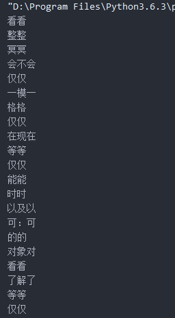
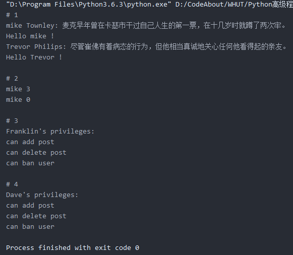
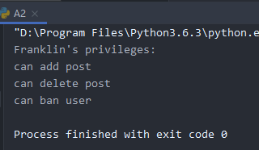

## # 1

> 检查word文档的连续重复字。
> 在word文档中，经常会由于键盘操作不小心而使得文档中出现连续的重复字，
> 例如“用户的的资料”或“需要需要用户输入”之类的情况。
> 使用扩展库python-docx对word文档(QT学习之路2.doc)进行检查并提示类似的重复汉字.

```python
from docx import Document
import re

qtDoc = Document('qt2.docx')
text = ''.join((p.text for p in qtDoc.paragraphs))
result = re.findall(r'(([\u4e00-\u9fa5、！：；，]).?\2)', text)
for word in result:
	print(word[0])
```



## # 2

> 类的练习,逐步完成下述每个单练习.每一个部分都应有对应的代码。
> 1. 创建一个名为 User 的类
> 其中包含属性 first_name 和 last_name，还有用户简介通常会存储的其他几个属性。在类 User 中定义一个名为 describe_user()的方法，它打印用户信息摘要；再定义一个名为 greet_user()的方法，它向用户发出个性化的问候。创建多个表示不同用户的实例，并对每个实例都调用上述两个方法。
>
> 2. 在上述 User 类中，添加一个名为login_attempts 的属性。
> 编写一个名为 increment_login_attempts()的方法，它将属性login_attempts 的值加 1。
> 再编写一个名为 reset_login_attempts()的方法，它将属性login_attempts 的值重置为 0。
> 根据 User 类创建一个实例，再调用方法increment_login_attempts()多次。
> 打印属性 login_attempts 的值，确认它被正确地递增；
> 然后，调用方法 reset_login_attempts()，并再次打印属性 login_attempts 的值，确认它被重置为 0。
>
> 3. 管理员是一种特殊的用户。
> 编写一个名为 Admin 的类，让它继承你为完成练习1或练习2而编写的 User 类。
> 添加一个名为 privileges 的属性，用于存储一个由字符串（如"can add post"、"can delete post"、"can ban user"等）组成的列表。编写一个名为 show_privileges()的方法，它显示管理员的权限。创建一个 Admin 实例，并调用这个方法。
>
> 4. 编写一个名为 Privileges 的类，它只有一个属性—privileges，其中存储了练习 2.3 所说的字符串列表。
> 将方法show_privileges()移到这个类中。在 Admin类中，将一个 Privileges 实例用作其属性。创建一个 Admin 实例，并使用方法show_privileges()来显示其权限。

```python
class User:
	def __init__(self, firstName, lastName, description):
		self.firstName = firstName
		self.lastName = lastName
		self.description = description
		self.loginAttempts = 0

	def describeUser(self):
		print('{} {}: {}'.format(self.firstName, self.lastName, self.description))

	def greetUser(self):
		print('Hello {} !'.format(self.firstName))

	def incrementLoginAttempts(self):
		self.loginAttempts += 1

	def resetLoginAttempts(self):
		self.loginAttempts = 0


class Admin(User):
	def __init__(self, firstName, lastName, description):
		User.__init__(self, firstName, lastName, description)
		self.privileges = ["can add post", "can delete post", "can ban user"]

	def showPrivileges(self):
		print("{}'s privileges:".format(self.firstName), end='\n')
		for privilege in self.privileges:
			print(privilege, end='\n')


class Admin2(User):
	def __init__(self, firstName, lastName, description):
		User.__init__(self, firstName, lastName, description)
		self.privileges = Privileges(["can add post", "can delete post", "can ban user"])

	def showPrivileges(self):
		print("{}'s privileges:".format(self.firstName), end='\n')
		self.privileges.showPrivileges()


class Privileges:
	def __init__(self, privileges):
		self.privileges = privileges

	def showPrivileges(self):
		for privilege in self.privileges:
			print(privilege, end='\n')


# 1
print('# 1')
userM = User('mike', 'Townley', '麦克早年曾在卡瑟市干过自己人生的第一票，在十几岁时就蹲了两次牢。')
userT = User('Trevor', 'Philips', '尽管崔佛有着病态的行为，但他相当真诚地关心任何他看得起的亲友。')
userM.describeUser()
userM.greetUser()
userT.describeUser()
userT.greetUser()
# 2
print('\n# 2')
userM.incrementLoginAttempts()
userM.incrementLoginAttempts()
userM.incrementLoginAttempts()
print('{} {}'.format(userM.firstName, userM.loginAttempts))
userM.resetLoginAttempts()
print('{} {}'.format(userM.firstName, userM.loginAttempts))
# 3
print('\n# 3')
adminF = Admin('Franklin', 'Clinton', '富兰克林生于洛圣都南部，没有接受过教育，也没有家庭。')
adminF.showPrivileges()
# 4
print('\n# 4')
adminD = Admin2('Dave', 'Norton', '此人对麦克重操旧业十分不满，觉得他在给自己找麻烦，但对麦克还是不错的，尽力帮他掩盖。')
adminD.showPrivileges()
```



> 5. 以上面2.1-2.4 而做的工作为基础，将 User、Privileges 和Admin 类存储在一个模块中，再创建一个文件，在其中创建一个 Admin 实例并对其调用方法 show_privileges()，以确认一切都能正确地运行。

```python
"""
A1.py
"""
class User:
	def __init__(self, firstName, lastName, description):
		self.firstName = firstName
		self.lastName = lastName
		self.description = description
		self.loginAttempts = 0

	def describeUser(self):
		print('{} {}: {}'.format(self.firstName, self.lastName, self.description))

	def greetUser(self):
		print('Hello {} !'.format(self.firstName))

	def incrementLoginAttempts(self):
		self.loginAttempts += 1

	def resetLoginAttempts(self):
		self.loginAttempts = 0


class Admin(User):
	def __init__(self, firstName, lastName, description):
		User.__init__(self, firstName, lastName, description)
		self.privileges = Privileges(["can add post", "can delete post", "can ban user"])

	def showPrivileges(self):
		print("{}'s privileges:".format(self.firstName), end='\n')
		self.privileges.showPrivileges()


class Privileges:
	def __init__(self, privileges):
		self.privileges = privileges

	def showPrivileges(self):
		for privilege in self.privileges:
			print(privilege, end='\n')
```

```python
"""
A2.py
"""
# https://blog.csdn.net/l8947943/article/details/79874180
from A1 import Admin

adminF = Admin('Franklin', 'Clinton', '富兰克林生于洛圣都南部，没有接受过教育，也没有家庭。')
adminF.showPrivileges()
```



> 6. 将User 类存储在一个模块中，并将 Privileges 和 Admin 类存储在另一个模块中。再创建一个文件，在其中创建一个 Admin 实例，并对其调用方法show_privileges()，确认一切都依然能够正确地运行。

```python
"""
B1.py
"""
class User:
	def __init__(self, firstName, lastName, description):
		self.firstName = firstName
		self.lastName = lastName
		self.description = description
		self.loginAttempts = 0

	def describeUser(self):
		print('{} {}: {}'.format(self.firstName, self.lastName, self.description))

	def greetUser(self):
		print('Hello {} !'.format(self.firstName))

	def incrementLoginAttempts(self):
		self.loginAttempts += 1

	def resetLoginAttempts(self):
		self.loginAttempts = 0
```

```python
"""
B2.py
"""
from B1 import User


class Admin(User):
	def __init__(self, firstName, lastName, description):
		User.__init__(self, firstName, lastName, description)
		self.privileges = Privileges(["can add post", "can delete post", "can ban user"])

	def showPrivileges(self):
		print("{}'s privileges:".format(self.firstName), end='\n')
		self.privileges.showPrivileges()


class Privileges:
	def __init__(self, privileges):
		self.privileges = privileges

	def showPrivileges(self):
		for privilege in self.privileges:
			print(privilege, end='\n')
```

```python
"""
B3.py
"""
from B2 import Admin

adminD = Admin('Dave', 'Norton', '此人对麦克重操旧业十分不满，觉得他在给自己找麻烦，但对麦克还是不错的，尽力帮他掩盖。')
adminD.showPrivileges()
```

