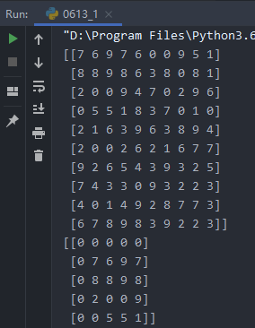

## # 1

> 为一维数组X的平均值计算自举的95％置信区间
> （即N次对数组的元素进行重新采样，计算每个样本的平均值，然后计算平均值的百分位数）

```python
import numpy as np

Z = np.random.randint(0, 10, (10, 10))
shape = (5, 5)
fill = 0
position = (1, 1)

R = np.ones(shape, dtype=Z.dtype) * fill
P = np.array(list(position)).astype(int)
Rs = np.array(list(R.shape)).astype(int)
Zs = np.array(list(Z.shape)).astype(int)

R_start = np.zeros((len(shape),)).astype(int)
R_stop = np.array(list(shape)).astype(int)
Z_start = (P - Rs // 2)
Z_stop = (P + Rs // 2) + Rs % 2
```



## # 2

> 考虑由两个向量（X，Y）描述的路径，如何使用等距样本对其进行采样

```python
import numpy as np

phi = np.arange(0, 10 * np.pi, 0.1)
a = 1
x = a * phi * np.cos(phi)
y = a * phi * np.sin(phi)

dr = (np.diff(x) ** 2 + np.diff(y) ** 2) ** .5  # segment lengths
r = np.zeros_like(x)
r[1:] = np.cumsum(dr)  # integrate path
r_int = np.linspace(0, r.max(), 200)  # regular spaced path
x_int = np.interp(r_int, r, x)  # integrate path
y_int = np.interp(r_int, r, y)
```

## # 3

> 考虑一个任意数组，编写一个函数来提取具有固定形状并以给定元素为中心的子部分
> （必要时填充为“ fill”值）

```python
import numpy as np

X = np.random.randn(100)  # random 1D array
N = 1000  # number of bootstrap samples
idx = np.random.randint(0, X.size, (N, X.size))
means = X[idx].mean(axis=1)
c = np.percentile(means, [2.5, 97.5])
print(c)
```

