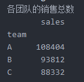
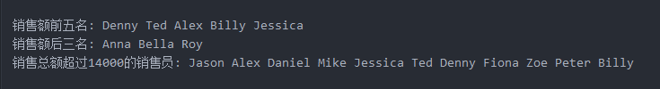
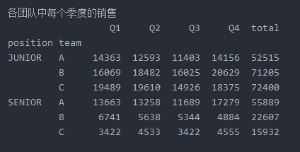
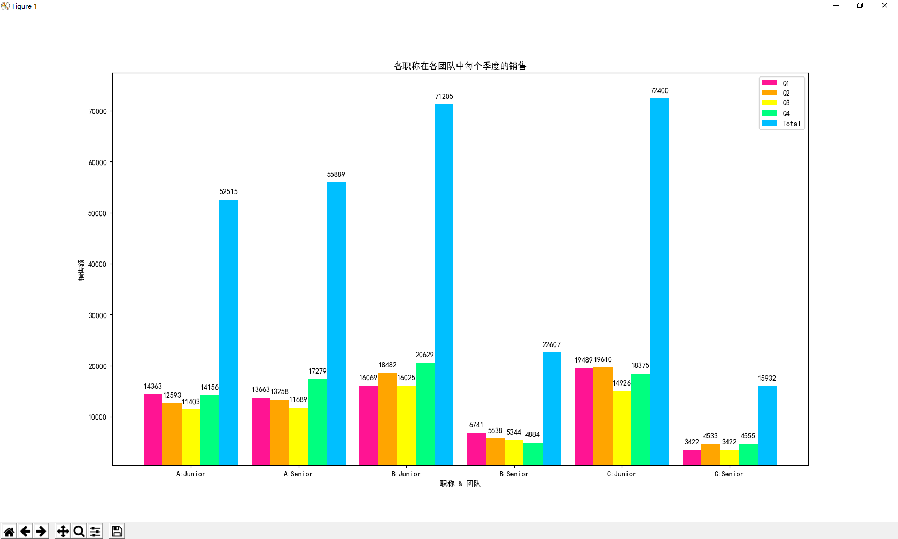

> 完成以下任务：
>
> 1. 为每个销售员销售数据新增一列为全年销售总额，列名“Total”.
> 2. 按团队进行统计全年销售总额。
> 3. 输出销售总额的前五名。
> 4. 输出销售总额的后三名。
> 5. 分别输出各团队的销售总数
> 6. 找出销售总额超过14000的销售员并为他们打上“good”标签。
> 7. 连接两个表，统计出各职称在各团队中每个季度的销售。
> 8. 希望评估各职位在各团队全年销售的排序。
> 9. 用直方图显示7，8中的结果。

```python
"""
initialData.py
"""
JUNIOR = 'JUNIOR'
SENIOR = 'SENIOR'

A = 'A'
B = 'B'
C = 'C'

salesmen = {
	'Jason': JUNIOR, 'Alex': JUNIOR, 'Daniel': JUNIOR, 'Mike': JUNIOR,
	'Jessica': SENIOR, 'Ted': SENIOR, 'Denny': JUNIOR, 'Fiona': JUNIOR,
	'Eric': JUNIOR, 'Max': SENIOR, 'William': SENIOR, 'Zoe': JUNIOR,
	'Peter': JUNIOR, 'Billy': JUNIOR, 'Tony': SENIOR, 'Roy': SENIOR,
	'Coco': JUNIOR, 'Bella': JUNIOR, 'Anna': JUNIOR, 'Dominic': JUNIOR,
	'Rena': SENIOR
}
teamBelong = [
	C, A, B, B, A, C, B, C, A, B, A, A, B, C, A, B, C, A, B, C, A
]
quarterSales = [
	[
		4411, 3539, 3565, 3787, 3455, 3422, 3255, 4283, 4765, 4112, 2863,
		4045, 3913, 4216, 2629, 2629, 3217, 2014, 1549, 3362, 4716
	],
	[
		4591, 3544, 3654, 3444, 4567, 4533, 4538, 4236, 3156, 3185, 3285,
		3581, 4536, 4384, 3856, 2453, 3254, 2312, 2310, 3145, 1550
	],
	[
		2736, 3465, 3566, 3576, 3778, 3422, 3090, 2345, 2218, 2218, 3267,
		3156, 3452, 3459, 1799, 3126, 3176, 2564, 2341, 3210, 2845
	],
	[
		3756, 5466, 4566, 4556, 5344, 4555, 4786, 4256, 2333, 2008, 3567,
		3345, 3421, 4123, 4356, 2876, 3129, 3012, 3300, 3111, 4012
	]
]

```

```python
from initailData import *
import numpy as np
import pandas as pd
import matplotlib.pyplot as plt
import matplotlib

# 销售员列表
salesmanArr = np.array(list(salesmen.keys()))  # dict.keys()返回的是迭代器而不是List
# 每个销售员全年销售总额
totalArr = np.array(quarterSales).sum(axis=0)
# 按团队进行统计全年销售总额
teamTotalFrame = pd.DataFrame({
	'team': teamBelong,
	'sales': totalArr
})
# 分别输出各团队的销售总数
print('各团队的销售总数')
print(teamTotalFrame.groupby(teamTotalFrame['team']).sum())
# 销售总额的前五名
print("\n销售额前五名: ", end='')
for eachSalesman in salesmanArr[totalArr.argsort()[-5:]]:
	print(eachSalesman, end=' ')
# 销售总额的后三名
print("\n销售额后三名: ", end='')
for eachSalesman in salesmanArr[totalArr.argsort()[:3]]:
	print(eachSalesman, end=' ')
# 找出销售总额超过14000的销售员
print("\n销售总额超过14000的销售员: ", end='')
for eachSalesman in salesmanArr[totalArr > 14000]:
	print(eachSalesman, end=' ')
# 各职称在各团队中每个季度的销售
print("\n\n各团队中每个季度的销售")
teamSalesFrame = pd.DataFrame({
	'position': list(salesmen.values()),
	'team': teamBelong,
	'Q1': quarterSales[0],
	'Q2': quarterSales[1],
	'Q3': quarterSales[2],
	'Q4': quarterSales[3],
	'total': totalArr
})
print(teamSalesFrame.groupby(['position', 'team']).sum())
# 直方图显示
data = teamSalesFrame.groupby(['team', 'position']).sum().to_numpy()

matplotlib.rcParams['font.sans-serif'] = ['SimHei']  # 设置中文字体
matplotlib.rcParams['axes.unicode_minus'] = False  # 和负号正常显示

# 绘制条形图
xLabel = ['A:Junior', 'A:Senior', 'B:Junior', 'B:Senior', 'C:Junior', 'C:Senior']
groupItemLabel = ['Q1', 'Q2', 'Q3', 'Q4', 'Total']
xBase = range(0, len(xLabel) * 2, 2)
xWidth = 0.35
colors = ['deeppink', 'orange', 'yellow', 'springgreen', 'deepskyblue']

rectangles = []
for index in range(len(groupItemLabel)):
	rectangles.append(plt.bar(
		x=[i + index * xWidth for i in xBase],
		height=data[:, index:index + 1].reshape(6),
		width=xWidth,
		color=colors[index],
		label=groupItemLabel[index]
	))
# y轴取值范围
plt.ylim(
	min(map(lambda arr: min(arr), data)) - 3000,
	max(map(lambda arr: max(arr), data)) + 5000
)
plt.ylabel("销售额")

# 设置x轴刻度显示值
# 参数一：中点坐标
# 参数二：显示值
plt.xticks([i + (xWidth * len(groupItemLabel) / 2 - xWidth / 2) for i in xBase], xLabel)
plt.xlabel("职称 & 团队")
plt.title("各职称在各团队中每个季度的销售")
# 设置题注
plt.legend()
# 编辑文本
for recArr in rectangles:
	for rec in recArr:
		height = rec.get_height()
		plt.text(
			rec.get_x() + rec.get_width() / 2,
			height + 1000, str(height),
			ha="center", va="bottom"
		)
plt.show()
```

### 各团队的销售总数



### 销售额



### 各团队中每个季度的销售



### 直方图

